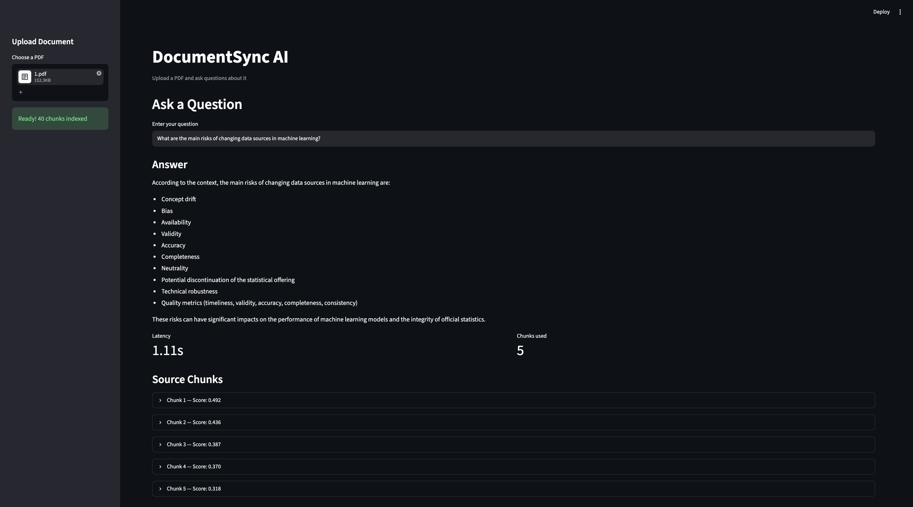

# DocumentSync AI — RAG-Powered Document Q&A System

A Retrieval-Augmented Generation (RAG) pipeline for semantic document Q&A. Upload any PDF and ask questions — the system retrieves the most relevant chunks and generates grounded, citation-aware answers.

---

## Architecture

```
PDF Upload
    │
    ▼
┌─────────────────────────────────────────┐
│           INGESTION LAYER               │
│  pdfplumber → text cleaning → chunking  │
│  4 strategies: fixed 256/512/1024 tok   │
│  + sentence-aware (NLTK)                │
└──────────────────┬──────────────────────┘
                   │
┌──────────────────▼──────────────────────┐
│           EMBEDDING LAYER               │
│  all-MiniLM-L6-v2 (sentence-transformers│
│  384-dim vectors, runs locally)         │
│  ChromaDB persistent vector store       │
└──────────────────┬──────────────────────┘
                   │
┌──────────────────▼──────────────────────┐
│           RETRIEVAL LAYER               │
│  Cosine similarity search               │
│  Tunable: top-k, similarity threshold   │
└──────────────────┬──────────────────────┘
                   │
┌──────────────────▼──────────────────────┐
│           GENERATION LAYER              │
│  Grounded prompt → Together AI LLM      │
│  Retry logic with exponential backoff   │
└──────────────────┬──────────────────────┘
                   │
┌──────────────────▼──────────────────────┐
│           EVALUATION HARNESS            │
│  200 auto-generated Q&A pairs/strategy  │
│  RAGAS: faithfulness, answer relevancy  │
│  context precision, context recall      │
│  LLM-as-judge via Groq                  │
└──────────────────┬──────────────────────┘
                   │
┌──────────────────▼──────────────────────┐
│           STREAMLIT UI                  │
│  PDF upload → query → answer + sources  │
│  Cosine scores + latency display        │
└─────────────────────────────────────────┘
```

---

## Tech Stack

| Layer | Tool |
|---|---|
| PDF parsing | pdfplumber |
| ArXiv ingestion | arxiv Python library |
| Text chunking | LangChain RecursiveCharacterTextSplitter + NLTK |
| Embeddings | sentence-transformers (all-MiniLM-L6-v2) |
| Vector store | ChromaDB (persistent, cosine similarity) |
| Orchestration | LangChain |
| LLM — answer generation | Together AI (Llama 3.1 8B) |
| LLM — Q&A generation | Groq (llama-3.1-8b-instant) |
| Evaluation | RAGAS (faithfulness, answer relevancy, context precision, context recall) |
| UI | Streamlit |

---

## Evaluation Results

Evaluated 4 chunking strategies using RAGAS metrics across 30 sampled Q&A pairs per strategy (120 LLM-as-judge calls each), with a separate judge LLM to avoid token budget conflicts.

| Strategy | Faithfulness | Answer Relevancy | Context Precision | Context Recall |
|---|---|---|---|---|
| fixed_256 | 0.358 | 0.226 | 0.133 | 0.069 |
| fixed_512 | 0.238 | 0.179 | 0.083 | 0.130 |
| **fixed_1024** | **0.336** | **0.232** | **0.212** | **0.252** |
| sentence | 0.306 | 0.154 | 0.077 | 0.086 |

**fixed_1024 wins on context precision and recall** — larger chunks preserve more contextual information, improving retrieval quality. The Streamlit UI uses fixed_1024 as the default strategy.

---

## Project Structure

```
documentsync-ai/
│
├── data/
│   ├── raw/                    # downloaded PDFs + metadata.json
│   └── processed/              # cleaned text files
│
├── vectorstore/                # ChromaDB persistent storage
│
├── eval/
│   ├── qa_pairs/               # auto-generated Q&A pairs (JSON)
│   └── results/                # RAGAS eval outputs (CSV)
│
├── src/
│   ├── ingestion/
│   │   ├── fetcher.py          # ArXiv API download
│   │   ├── parser.py           # pdfplumber extraction
│   │   ├── cleaner.py          # text cleaning (regex)
│   │   └── chunker.py          # 4 chunking strategies
│   │
│   ├── embedding/
│   │   └── embedder.py         # sentence-transformers + ChromaDB
│   │
│   ├── retrieval/
│   │   └── retriever.py        # cosine similarity search
│   │
│   ├── generation/
│   │   └── generator.py        # Together AI LLM + retry logic
│   │
│   └── evaluation/
│       ├── qa_generator.py     # auto-generate Q&A pairs
│       └── evaluator.py        # RAGAS metrics runner
│
├── app/
│   └── streamlit_app.py        # Streamlit UI
│
├── run_pipeline.py             # end-to-end pipeline runner
├── config.py                   # all tunable parameters
└── requirements.txt
```

---

## Setup

**Prerequisites:** Python 3.11

```bash
git clone https://github.com/ana-lan/documentsync-ai
cd documentsync-ai

python3.11 -m venv venv
source venv/bin/activate

pip install -r requirements.txt
```

**Environment variables** — copy `.env.example` to `.env` and fill in:

```bash
cp .env.example .env
```

```
GROQ_API_KEY=your_groq_api_key
GROQ_JUDGE_API_KEY=your_second_groq_key   # for RAGAS evaluation
TOGETHER_API_KEY=your_together_api_key
```

Get free API keys:
- Groq: [console.groq.com](https://console.groq.com)
- Together AI: [api.together.ai](https://api.together.ai)

---

## Usage

### Run the full pipeline (fetch papers → embed → test query)

```bash
python run_pipeline.py
```

### Launch the Streamlit UI

```bash
streamlit run app/streamlit_app.py
```

Upload any PDF and ask questions about it.

### Run evaluation harness

```bash
# generate Q&A pairs for all 4 strategies
python -m src.evaluation.qa_generator

# run RAGAS eval across all strategies
python -m src.evaluation.evaluator
```

---

## Key Design Decisions

**Why 4 chunking strategies?**
Chunk size fundamentally affects retrieval quality. Too small (256 tokens) and chunks lack context; too large and retrieval becomes imprecise. The eval harness measures this empirically with RAGAS metrics rather than assuming.

**Why LLM-as-judge eval?**
RAGAS uses a separate LLM to score faithfulness and relevancy — this is the industry-standard approach used by teams at Cohere, LlamaIndex, and Anthropic. Manual annotation of 200+ Q&A pairs would introduce human bias and isn't scalable.

**Why separate judge LLM?**
Running generation and evaluation on the same API account causes token budget conflicts. Using a second Groq account as the judge ensures clean, uninterrupted evaluation runs.

**Why cosine similarity over L2 distance?**
ChromaDB defaults to L2 distance. For sentence-transformer embeddings, cosine similarity is the correct metric — it measures angular similarity between vectors, which is what the model was trained to optimize.

---

## Demo



Upload any PDF → ask a question → get a grounded answer with source chunks and cosine similarity scores.